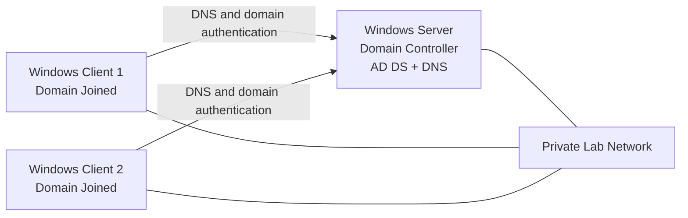

# Windows Server Active Directory Lab


A completed hands-on Windows Server lab in which I built and promoted my own domain controller, configured Active Directory Domain Services and DNS, and joined two Windows endpoint devices to the domain.

> **Project status:** Completed. This repository documents work that had already been implemented and tested. It is not presented as a future build guide or an unfinished lab.

## Project overview

The goal of this project was to create a small working Microsoft Active Directory environment that reproduced common tasks performed by IT support and junior systems administrators.

The completed environment included:

- One Windows Server configured as the domain controller
- Active Directory Domain Services installed and configured
- An internal Active Directory domain and forest
- DNS integrated with the domain environment
- Basic directory administration for users and computers
- Two Windows client devices successfully joined to the domain
- Domain authentication and connectivity checks

Sensitive environment details such as the original domain name, administrator credentials, IP addresses, and device names have intentionally been omitted or generalized.

## Lab topology



## Work completed

### 1. Prepared the Windows Server

- Installed and prepared the Windows Server operating system.
- Assigned the server a consistent hostname.
- Configured the server network settings for the lab environment.
- Ensured the server used a stable address suitable for directory and DNS services.
- Applied available operating-system updates before role deployment.

### 2. Installed Active Directory Domain Services

- Added the **Active Directory Domain Services** server role.
- Included the required management tools.
- Promoted the server to a domain controller.
- Created a new Active Directory forest and internal domain.
- Completed the required restart and post-promotion checks.

### 3. Configured and verified DNS

- Used the domain controller as the internal DNS server.
- Confirmed that the Active Directory DNS zone was available.
- Verified that client devices could resolve the domain and domain controller.
- Confirmed that the DNS configuration supported domain discovery and authentication.

### 4. Performed basic directory administration

- Opened and used **Active Directory Users and Computers**.
- Verified the domain structure and default containers.
- Confirmed that the domain controller and joined endpoints appeared in Active Directory.
- Performed basic user and computer object administration within the lab.

### 5. Joined two Windows devices to the domain

For each endpoint, I:

1. Confirmed that the client could communicate with the domain controller.
2. Configured the client to use the domain controller for DNS resolution.
3. Joined the client to the Active Directory domain.
4. Restarted the client after the domain join.
5. Signed in using domain credentials.
6. Verified that the computer account appeared in Active Directory.

## Validation performed

The completed environment was checked by confirming:

- The Windows Server reported that it was a domain controller.
- Active Directory administrative consoles opened successfully.
- The Active Directory domain and DNS zone were present.
- Both clients resolved the domain controller through DNS.
- Both clients reported membership in the Active Directory domain.
- Domain credentials could be used on the joined endpoints.
- Both client computer objects appeared in Active Directory.
- Basic network communication worked between the clients and domain controller.

See [Validation and test evidence](docs/VALIDATION.md) for the commands and checks used to demonstrate the result.

## Technologies and tools

| Area | Technology or tool |
|---|---|
| Server platform | Microsoft Windows Server |
| Directory services | Active Directory Domain Services |
| Name resolution | DNS |
| Administration | Server Manager, Active Directory Users and Computers |
| Client platform | Microsoft Windows |
| Networking | TCP/IP, static server addressing, DNS client configuration |
| Verification | PowerShell, Command Prompt, Windows system properties |

## Skills demonstrated

- Windows Server installation and configuration
- Active Directory deployment
- Domain-controller promotion
- DNS configuration and troubleshooting
- Windows domain joins
- User and computer object administration
- Client/server connectivity testing
- Domain authentication validation
- Technical documentation
- Security-conscious redaction of lab information

## Repository structure

```text
.
├── README.md
├── docs
│   ├── BUILD-NOTES.md
│   ├── SCREENSHOTS.md
│   ├── TROUBLESHOOTING.md
│   └── VALIDATION.md
└── scripts
    └── Test-ADLab.ps1
```

## Documentation

- [Implementation notes](docs/BUILD-NOTES.md)
- [Validation and test evidence](docs/VALIDATION.md)
- [Troubleshooting reference](docs/TROUBLESHOOTING.md)
- [Screenshot checklist](docs/SCREENSHOTS.md)
- [PowerShell validation script](scripts/Test-ADLab.ps1)

## Key lessons

This project reinforced that Active Directory depends heavily on correct DNS configuration. A device can have general network access and still fail to locate or join a domain when it uses the wrong DNS server. The lab also demonstrated the relationship between the domain controller, DNS records, computer accounts, domain credentials, and Windows client configuration.

## Security notes

- No real passwords or credentials are stored in this repository.
- Domain, server, endpoint, and network identifiers are generalized.
- Screenshots should be reviewed and redacted before being uploaded.
- This lab was built for learning and portfolio demonstration purposes.

## Author

**Dewald Pretorius**  
L2 IT Support Engineer with hands-on experience in Windows troubleshooting, networking, Microsoft environments, and infrastructure support.
